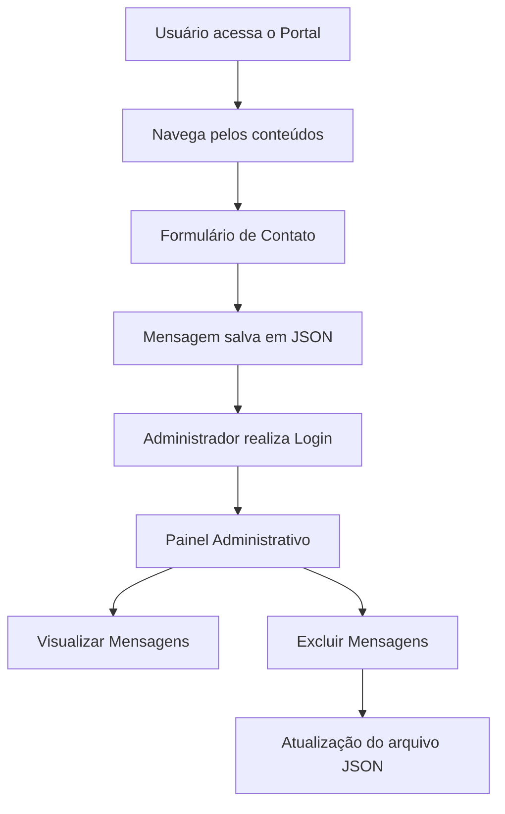
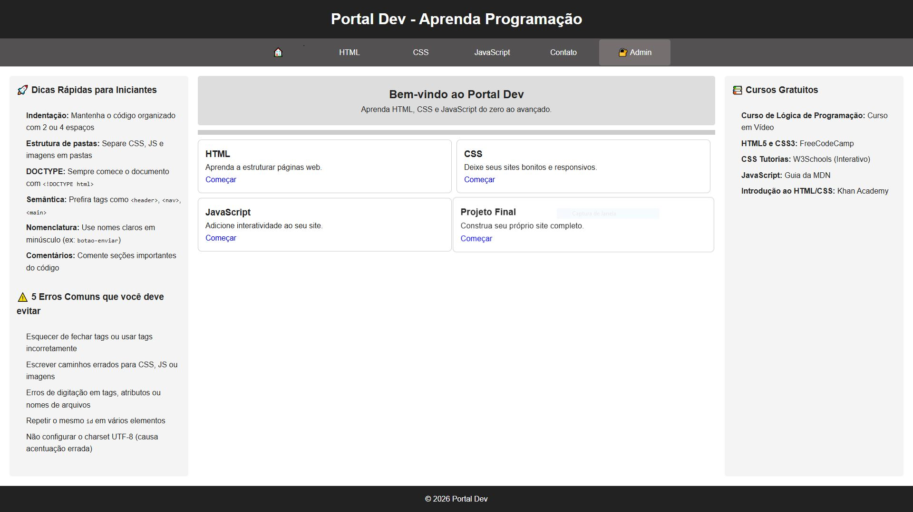
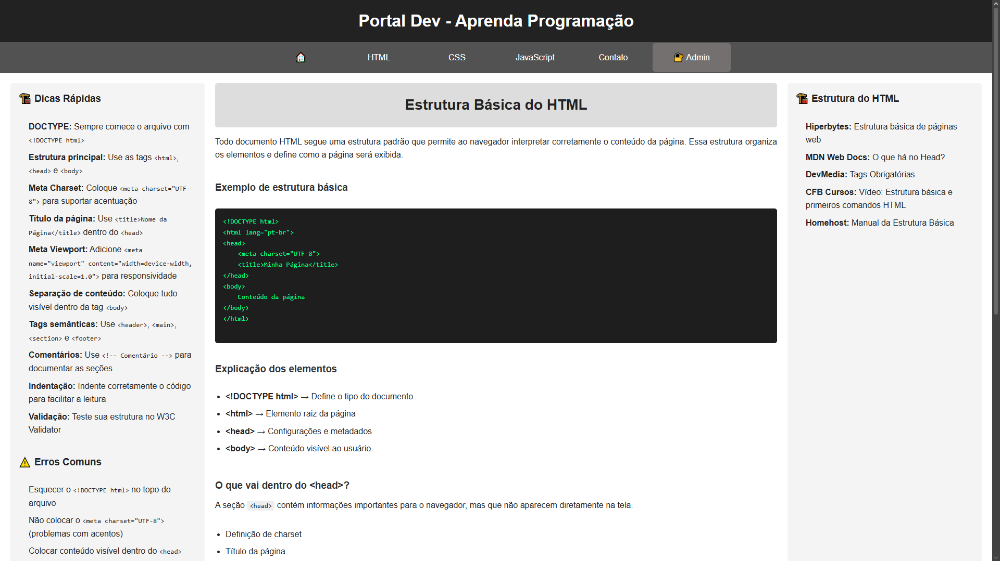
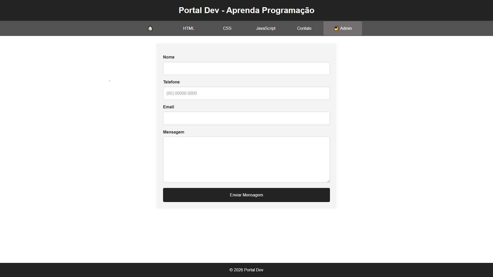
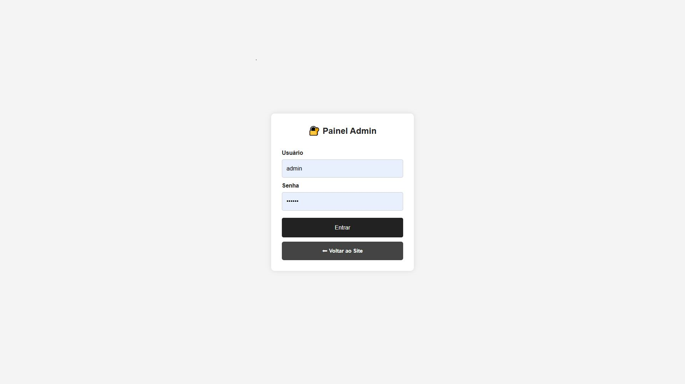
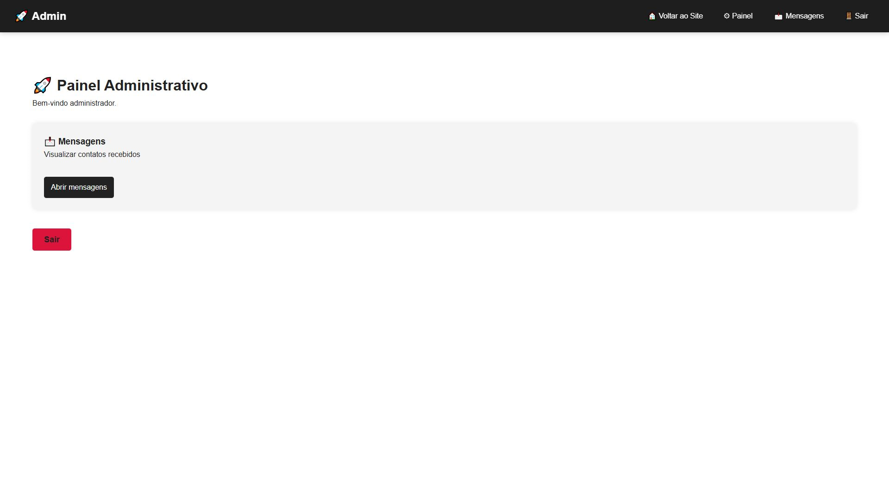
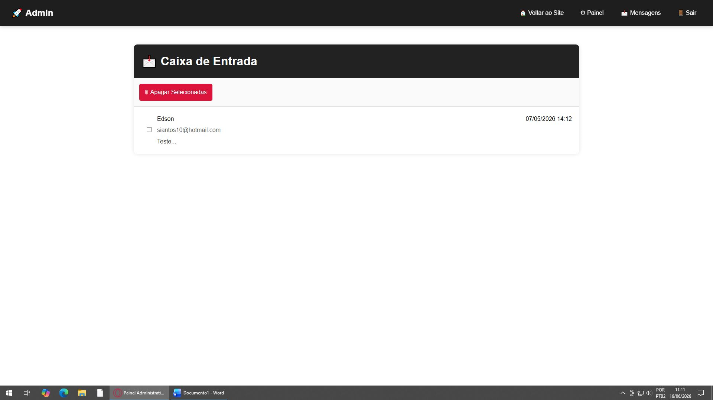

# 🚀 Portal Dev

Plataforma acadêmica para aprendizado de HTML5, CSS3 e JavaScript, desenvolvida em PHP com armazenamento de dados em JSON.


---

## 📑 Sumário

* [Sobre o Projeto](#-sobre-o-projeto)
* [Objetivos](#-objetivos)
* [Funcionalidades](#-funcionalidades)
* [Tecnologias Utilizadas](#-tecnologias-utilizadas)
* [Estrutura do Projeto](#-estrutura-do-projeto)
* [Fluxo de Funcionamento](#-fluxo-de-funcionamento)
* [Capturas de Tela](#-capturas-de-tela)
* [Como Executar o Projeto](#-como-executar-o-projeto)
* [Conceitos Aplicados](#-conceitos-aplicados)
* [Autor](#-autor)
* [Conclusão](#-conclusão)

---

<a id="sobre-o-projeto"></a>
## 📖 Sobre o Projeto

O **Portal Dev** é uma plataforma web educacional desenvolvida para centralizar conteúdos introdutórios sobre desenvolvimento front-end.

O sistema reúne conceitos de **HTML5**, **CSS3** e **JavaScript**, oferecendo uma experiência organizada para estudantes e iniciantes que desejam aprender os fundamentos da construção de páginas web.

Além do ambiente educacional, a aplicação possui um sistema de contato integrado e uma área administrativa para gerenciamento das mensagens enviadas pelos usuários.

O projeto foi desenvolvido utilizando PHP e armazenamento de dados em JSON, dispensando a utilização de bancos de dados relacionais.

---

<a id="objetivos"></a>
## 🎯 Objetivos

* Facilitar o aprendizado de tecnologias web.
* Centralizar conteúdos em uma única plataforma.
* Demonstrar a integração entre Front-end e Back-end.
* Aplicar conceitos acadêmicos estudados na disciplina.
* Implementar um sistema completo utilizando PHP sem banco de dados relacional.

---

<a id="funcionalidades"></a>
## ✨ Funcionalidades

### 🌐 Área Pública

* ✅ Página inicial com apresentação da plataforma
* ✅ Navegação entre módulos de aprendizagem
* ✅ Conteúdo sobre HTML5
* ✅ Conteúdo sobre CSS3
* ✅ Conteúdo sobre JavaScript
* ✅ Página de Projeto Final
* ✅ Formulário de contato
* ✅ Máscara automática para telefone
* ✅ Feedback visual de envio

### 🔐 Área Administrativa

* ✅ Login de administrador
* ✅ Controle de sessão
* ✅ Dashboard administrativo
* ✅ Listagem de mensagens
* ✅ Visualização detalhada de mensagens
* ✅ Exclusão de registros
* ✅ Logout seguro

### 📱 Recursos Extras

* ✅ Layout responsivo
* ✅ Estrutura modularizada
* ✅ Persistência em JSON
* ✅ Reutilização de componentes
* ✅ Navegação dinâmica

---

<a id="tecnologias-utilizadas"></a>
## 🛠 Tecnologias Utilizadas

| Tecnologia      | Finalidade                          |
| --------------- | ----------------------------------- |
| HTML5           | Estruturação semântica              |
| CSS3            | Estilização e responsividade        |
| JavaScript ES6+ | Interatividade e manipulação do DOM |
| PHP 7.4+        | Processamento backend               |
| JSON            | Persistência de dados               |
| Flexbox         | Organização de layouts              |
| Media Queries   | Adaptação para dispositivos móveis  |

---

<a id="estrutura-do-projeto"></a>
## 📂 Estrutura do Projeto

```text
portaldev-php/
│
├── admin/
│   ├── includes/
│   │   ├── admin-footer.php
│   │   └── admin-header.php
│   │
│   ├── deletar.php
│   ├── login.php
│   ├── logout.php
│   ├── mensagens.php
│   ├── painel.php
│   └── visualizar.php
│
├── css/
│   ├── admin.css
│   ├── components.css
│   ├── forms.css
│   ├── layout.css
│   ├── responsive.css
│   └── style.css
│
├── data/
│   └── mensagens.json
│
├── includes/
│   ├── header.php
│   └── footer.php
│
├── pages/
│   ├── contato.php
│   ├── css-intro.php
│   ├── html-estrutura.php
│   ├── html-intro.php
│   ├── js-intro.php
│   └── projeto-final.php
│
├── index.php
├── script.js
└── README.md
```

### Organização das Pastas

| Pasta     | Função                         |
| --------- | ------------------------------ |
| admin     | Área administrativa do sistema |
| css       | Arquivos de estilização        |
| data      | Armazenamento das mensagens    |
| includes  | Componentes reutilizáveis      |
| pages     | Conteúdo educacional           |
| script.js | Scripts globais                |
| index.php | Página inicial                 |

---

<a id="fluxo-de-funcionamento"></a>
## 🔄 Fluxo de Funcionamento



---

<a id="capturas-de-tela"></a>
## 📸 Capturas de Tela

### 🏠 Página Inicial

<p align="center">
  
</p>

Página principal do Portal Dev, apresentando os módulos de aprendizagem, dicas para iniciantes e navegação para os conteúdos disponíveis.

---

### 📚 Conteúdo Educacional

<p align="center">
  
</p>

Exemplo de conteúdo didático disponibilizado na plataforma, abordando conceitos fundamentais de desenvolvimento web.

---

### 📩 Formulário de Contato

<p align="center">
  
</p>

Formulário para envio de dúvidas, sugestões e mensagens, com validação e máscara dinâmica para telefone.

---

### 🔐 Área Administrativa

<table align="center">
<tr>
<td align="center">
<b>Login Administrativo</b><br><br>

</td>

<td align="center">
<b>Dashboard Administrativo</b><br><br>

</td>
</tr>
</table>

Área restrita destinada ao gerenciamento da plataforma e acesso às funcionalidades administrativas.

---

### 📨 Gerenciamento de Mensagens

<p align="center">
  
</p>

Tela responsável pela visualização, consulta e gerenciamento das mensagens enviadas pelos usuários através do formulário de contato.

---

<a id="como-executar-o-projeto"></a>
## 🚀 Como Executar o Projeto

### Pré-requisitos

* PHP 7.4 ou superior
* Apache
* XAMPP

### 1. Clonar o Repositório

```bash
git clone https://github.com/siantos10/portaldev-php.git
```

### 2. Copiar para o Servidor Local

Windows:

```text
C:\xampp\htdocs\
```

Linux:

```text
/opt/lampp/htdocs/
```

macOS:

```text
/Applications/XAMPP/xamppfiles/htdocs/
```

---

### 3. Iniciar o Apache

Abra o XAMPP Control Panel e clique em:

```text
Start → Apache
```

---

### 4. Verificar Permissões

Certifique-se de que o arquivo:

```text
/data/mensagens.json
```

possui permissões de leitura e escrita.

---

### 5. Acessar o Sistema

Portal Público:

```text
http://localhost/portaldev-php/
```

Área Administrativa:

```text
http://localhost/portaldev-php/admin/login.php
```

---

<a id="conceitos-aplicados"></a>
## 🎓 Conceitos Aplicados

### HTML5

* Estrutura semântica
* Formulários
* Navegação entre páginas
* Organização de conteúdo

### CSS3

* Flexbox
* Responsividade
* Media Queries
* Componentização visual
* Organização modular

### JavaScript

* Manipulação do DOM
* Eventos
* Expressões Regulares
* Máscara de telefone
* Controle de navegação

### PHP

* Includes
* Sessões
* Manipulação de arquivos
* Redirecionamentos
* Controle de autenticação

### JSON

* Armazenamento persistente
* Serialização de dados
* Leitura e escrita de arquivos

---

## 📚 Aprendizados Obtidos

Durante o desenvolvimento deste projeto foram praticados conhecimentos relacionados a:

* Desenvolvimento Front-end
* Desenvolvimento Back-end
* Integração entre camadas
* Organização de projetos PHP
* Controle de sessões
* Manipulação de arquivos JSON
* Estruturação semântica de páginas
* Responsividade
* Boas práticas de programação

---

<a id="autor"></a>
## 👨‍💻 Autor

**Edson M. Santos**

Projeto acadêmico desenvolvido para a disciplina de Desenvolvimento Web.

---

## 📜 Licença

Projeto desenvolvido exclusivamente para fins educacionais e acadêmicos.

---

<a id="conclusao"></a>
## 🏁 Conclusão

O Portal Dev permitiu a aplicação prática dos principais conceitos estudados em Desenvolvimento Web, integrando HTML, CSS, JavaScript e PHP em uma solução funcional.

A utilização de armazenamento em JSON possibilitou compreender o funcionamento da persistência de dados sem a necessidade de bancos relacionais, enquanto a implementação da área administrativa reforçou conceitos importantes de autenticação, controle de acesso e manipulação de arquivos.

O projeto representa a consolidação dos conhecimentos adquiridos ao longo da disciplina, demonstrando a capacidade de desenvolver uma aplicação web completa, organizada e responsiva.
